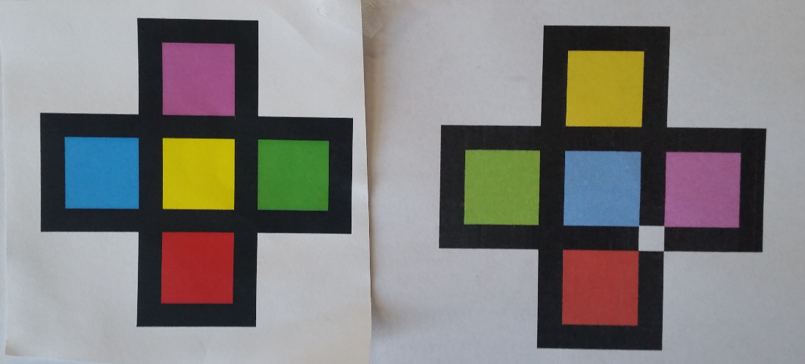

# RainbowTag

The source code for the paper https://ieeexplore.ieee.org/document/9743123 can be found in the code folder. See
https://juloss.github.io/RainbowTag/ for RainbowTag demo videos and more.

## How to use the code:

1. Install the required packages: opencv, colormath (version 3.0.0, https://pypi.org/project/colormath/), numpy, numba, shapely, imageio, matplotlib, imutils, csv.

2. After installation, replace the file *color_objects.py* in the installed colormath package to *color_objects.py* given in this repository. 
If a python environment is used, the file should be in *\Lib\site-packages\colormath*.
(The conversion matrices in the python file at line 622 for RGB to XYZ and for XYZ to RGB are slightly changed based on information from http://brucelindbloom.com/. Differences between the old and new matrices are not big.)

3. Open the *parameters.py* file. Set the images_folder to the location where you want to store your images. The default folder is *image* inside the *rainbowtag* folder. Also set the *color_tables_folder* variable to a location where there is about 4 gigabytes of free space. The default folder is *color_tables* inside the *rainbowtag* folder.

4. Create color lookup tables by running the script *dynamic_color_master_table.py*. *Note: this takes hours but it has to be done only once.* The two resulting files together will be around 4 gigabytes. (Tables can be made smaller by setting LMS_quantization_number = 255 in *parameters.py*, however, this will result in slightly less precise color conversions. Note that if lighting conditions are fixed, it is also possible to pre-compute a smaller table that is specific to those lighting conditions.)
   
5. After the tables are created, open the *parameters.py* file again. Set the variable *create_color_tables = False*.

6. At this point, *white_point_selector.py* can be run. The script *white_point_selector.py* helps with 2 things (both are explained in the section below):
    - adjusting the CMYK values of the printed markers, and
    - adjusting the white point that is best suited to the given lighting conditions.

Once the markers are printed and the white point is chosen:

7. Run the script *main_process_and_save.py* to process the images provided in the *images* folder. Note that this uses a default white point given in the file *white_point.npy* in the *images* folder.

    *Note:* The default *white_point.npy* in the *images* folder worked for both 2700K and 6500K lightbulbs in the experiments in the paper. However, it had to be adjusted when the lighting was weak and more yellowish such as in the video *"Weak yellowish illumination"* at https://juloss.github.io/RainbowTag/.

**Getting the detection results:**
- Processed image files are placed in a folder called *processed_images* in the *image* folder.
- Detected marker id-s can be extracted from the variable *marker_code* at line 144 in the script *main_process_and_save.py*.

## Printing the markers and white point selection:

**Note: properly adjusting the CMYK values for the markers is important for the detector to function optimally.**

The 30 markers to print are given in the *markers* folder as svg files.

### Parameters used in the experiments in the paper:
- Printer: Xerox R laser
printer, model C8055
- CMYK values for red, yellow, green, blue, and magenta were (0, 80, 90, 0), (0, 5, 100, 0), (40, 0, 90, 0), (70, 40, 0, 0), (10, 60, 0, 0), respectively
- *Note:* The marker svg-s in the *markers* folder are created using the above CMYK values.

### Using other printers

Since different printers can interpret CMYK values differently, it is important to adjust the CMYK values for a given printer. To adjust the CMYK values in the svg files, open a marker svg file in *Inkscape* (https://inkscape.org/), for example. Select the patches of the markers (first *right click* on a marker and *Ungroup* it), and use the CMYK color chooser to adjust the color of the patches.

Optimizing the CMYK color values for a printer should take a few iterations of printing and testing detection quality (see below). As an *approximate visual guideline*, the five colors should look to the human eye: 
- as different from each other as possible,
- not too bright or too dark,
- saturated (as opposed to “washed out”),
- magenta should be given extra attention, it should look sufficiently different from both red and blue.

For example, see the image below (best viewed on a monitor with good color reproduction). The left marker image is better than the right one because colors looks more saturated, and also because green and yellow look more different from each other.

  

Note that the white point can be either set to a standard illuminant, or customized using white_point_selector.py. To set a standard illuminant, a list is given in the paramteres.py script. For example, daylight is *D65_XYZ = XYZColor(0.9504, 1.00000, 1.08883)*. To use one of these illuminants, set the *white_point_xyz* variable in the file *main_process_and_save.py* at line 230. For example, *white_point_xyz = XYZColor(0.9504, 1.00000, 1.08883)*.

To test detection quality (when adjusting the CMYK values) and customize the white point, take a video of the markers with the given camera in the intended lighting conditions (if there is more than one then all lighting conditions). A white object should be visible in the video(s) (a white sheet of paper is sufficient.) Put the image frames into your image folder. Then run the script white_point_selector.py.

A (matplotlib) window should open with 3 panels. To choose a new white point, find a white object in the top panel, and click on it. You can move back and forth in the images folder with the keys ‘[‘ and ‘]’ to choose a white point from different image files. In the middle panel, you can see the Bradford chromatic adaptation transform applied to the image. Intuitively, this is how the algorithm sees colors with the chosen white point. In the bottom panel, the detected color patches are shown. Marker CMYK values and the white point should be adjusted so that the detected patches tightly cover the patches of the marker with matching colors. Once a good white point is selected, press ‘v’ to save the white point to the folder *sampled_white_point* in the *images* folder. (If there are more than one lighting conditions, choose a white point for each, take the average of the CIE XYZ values to be the common white point, and set the white point in the code the same way as for the standard illuminants (see above). Note that whenever there is a click in the top panel, the script prints the estimated white point CIE XYZ values.) To use this new white point, replace the the file *white_point.npy* in the images folder with the file *white_point.npy* in the *sampled_white_point* folder.

If the detected patches in the bottom panel are not very good, e.g., the algorithm mixes up red and magenta, then adjust the CMYK values of the markers considering the approximate visual guideline. Then print and check detection quality. Repeat until the patches in the bottom panel are detected properly.

*Note:* In more yellowish lighting conditions, it is possible that even after adjusting the CMYK values, the red and magenta patches of a marker both show up as red patches in the bottom panel (because in yellow lighting conditions magenta shifts to red.) Unless the patches look very similar in color, the algorithm should be able to figure out which one is red and which one is yellow (see the paper for details.)

# Improving RainbowTag

1. To speed up the code:
    - Various parts of the algorithm could be parallelized. For example, an image could be divided into smaller parts and the marker search algorithm could be run in parallel on each sub image. In the present implementation, the marker search algotihm is completely sequential. 
    - *numba* is used to speed up some parts of the code. However, numba cannot speed up a python function that uses *colormath*. Rewriting these functions without colormath and using numba could make the code faster.
    - Rewrite the code in C++.
2. More color squares could be added to get more marker combinations. This would require a new search algorithm over the detected patches.
3. The algorithm identifies color patches using tools from color science (e.g., hue uniform IPT color space). Another approach could be to learn the colors in the intended lighting conditions. 

*Feel free to contact me if you are interested in collaborating on color fiducial markers.*

# Legal mumbo jumbo
This code can be used for research purposes. For other purposes, please check with Concordia University, Indus.ai and NSERC.